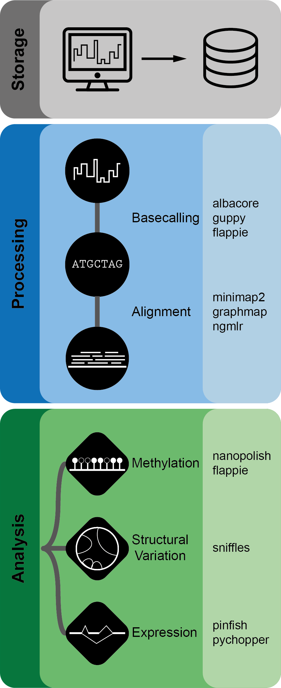

# Introduction

Nanopype is a snakemake based pipeline providing convenient Oxford Nanopore Technology (ONT) data processing and storage solutions.

The pipeline is split in a *processing* part including basecalling and alignment and an *analysis* part covering further downstream applications.
A summary of all included tools is given in the **[tools](tools.md)** section.

To get started the **[installation](installation/prerequisites.md)** chapter describes the available installation options depending on the operation system, available hardware and already existing environments.

Recurring steps of the nanopore data analysis are covered under **[workflow](usage/general.md)** for both local and cluster usage.

The **modules** part covers an in depth description of all available tools and workflows together with their respective configuration options. This section is the main reference of the pipeline.

Finally for new users the **[tutorial](examples/intro.md)** might be helpful to learn the general concepts and usage of the pipeline. To complete the tutorial the test reads included in the package are sufficient and no separate wet-lab experiemnt is required.
